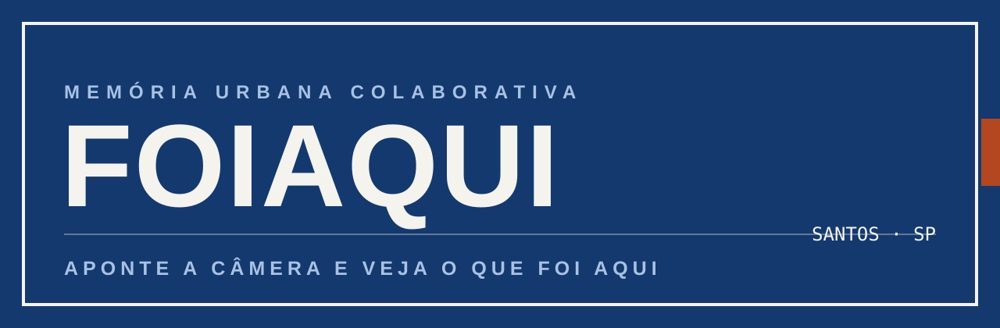
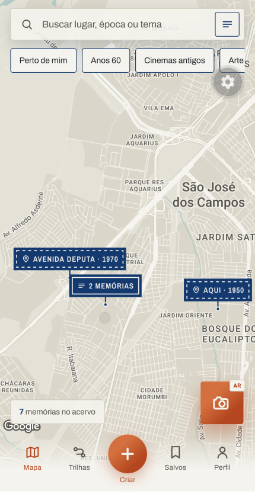
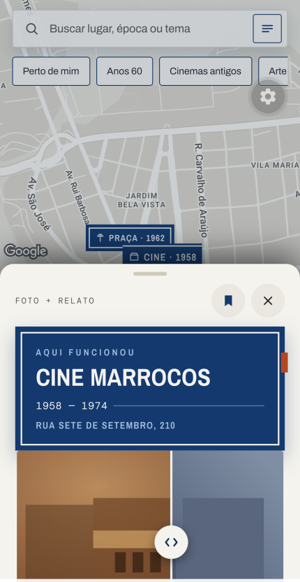
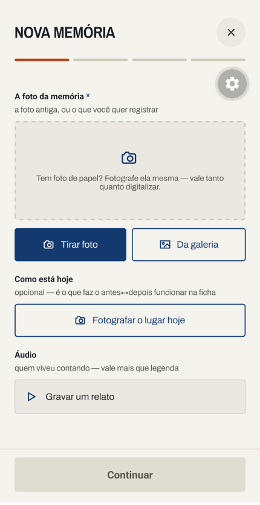
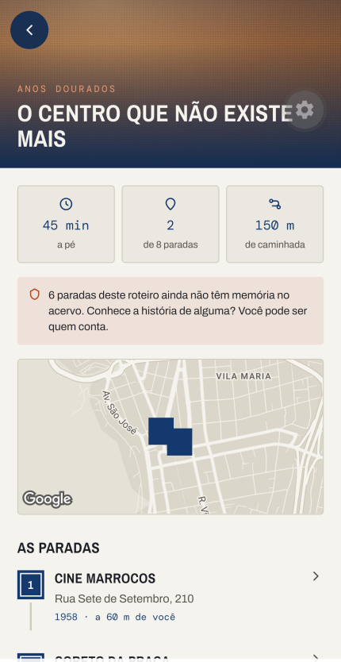
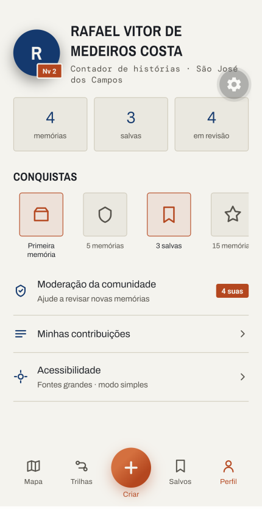
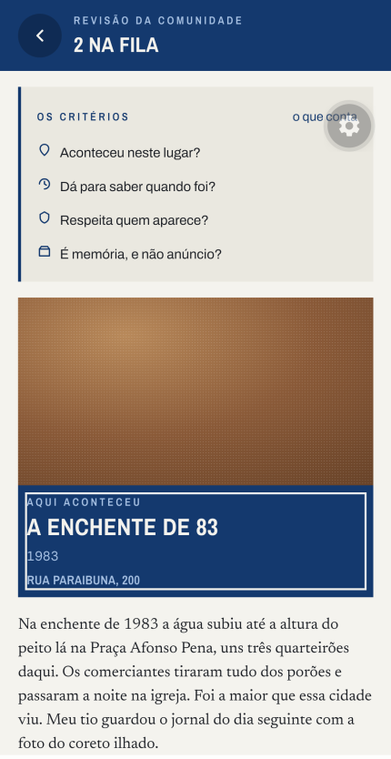
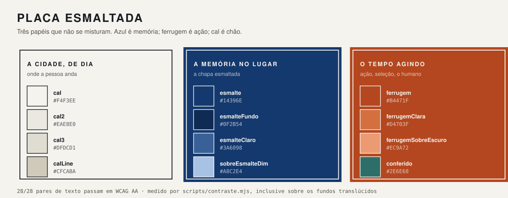

<p align="center">
  
</p>

<p align="center">
  <b>Aponte a câmera e veja o que foi aqui.</b>
</p>

<p align="center">
  
  
  
  
  
</p>

---

A memória das cidades some junto com quem viveu nelas. Ela está em gavetas, na
cabeça dos mais velhos e em arquivos que ninguém abre — e falta uma ponte entre
o lugar físico e a sua história. Você passa por um prédio todo dia sem saber o
que aconteceu ali.

**FoiAqui** liga o lugar à memória no ponto exato onde ela aconteceu. Qualquer
pessoa contribui com foto, relato, áudio ou vídeo; a comunidade modera. A cidade
vira um museu vivo.

Projeto de UX pela metodologia **Duplo Diamante**, com protótipo em React Native.
Cidade-piloto: **São José dos Campos–SP** — e o acervo semeado é real: oito
lugares da cidade, doze memórias de 1865 a 2021, com coordenadas do
OpenStreetMap e fonte pública declarada em cada uma.

📄 **[O dossiê completo do projeto](https://claude.ai/code/artifact/84a310f1-57f1-4027-8204-adce8bcf60bf)** — problema, benchmarking, as 12 decisões, a identidade e o estado real.

<br>

## As telas

<table>
<tr>
<td width="33%" align="center"><br><sub><b>Mapa</b><br>pins que se agrupam quando<br>ficariam empilhados</sub></td>
<td width="33%" align="center"><br><sub><b>Ficha da memória</b><br>bottom sheet sobre o mapa,<br>com slider passado↔presente</sub></td>
<td width="33%" align="center"><br><sub><b>Adicionar</b><br>foto, vídeo e áudio reais,<br>com rascunho automático</sub></td>
</tr>
<tr>
<td align="center"><br><sub><b>Trilha</b><br>percurso a pé, e a admissão<br>honesta do que falta</sub></td>
<td align="center"><br><sub><b>Perfil</b><br>nível e conquistas derivados<br>do uso real, não de mock</sub></td>
<td width="33%" align="center"><br><sub><b>Moderação</b><br>critérios públicos e recusa<br>que diz o motivo</sub></td>
</tr>
<tr>
<td colspan="3">

> [!NOTE]
> Telas capturadas em aparelho real, em *development build*. A **AR** ficou de fora da
> galeria de propósito: a tela é a câmera, então todo print mostra a sala de quem tirou.

</td>
</tr>
</table>

<br>

## O que funciona de verdade

| Tela | Comportamento real |
|:--|:--|
| **Mapa** | `react-native-maps` com estilo próprio · busca por lugar, época e tema · filtros que filtram · agrupamento de pins · distância real até você |
| **Ficha** | bottom sheet de três alturas · slider passado↔presente · áudio que toca · compartilhar com deep link · memórias vizinhas por proximidade |
| **Câmera AR** | câmera real e **bússola**: os cards seguem a direção em que o aparelho aponta, somem fora do campo de visão e indicam para que lado girar · sai sozinha por inatividade |
| **Adicionar** | 4 passos · foto e vídeo pela câmera ou galeria · gravação de áudio · GPS com ajuste manual e geocodificação reversa · década **e** ano exato · rascunho salvo sozinho |
| **Trilhas** | lista de percursos e tela de trilha com mini-mapa, paradas numeradas e traçado |
| **Moderação** | fila de revisão por pares · quatro critérios públicos · recusa que exige apontar o critério · denúncia devolve o publicado para a fila · aprovar publica no mapa |
| **Linha do tempo** | régua de décadas sobre o mapa, **incluindo as vazias** — o buraco é a informação: "ninguém contou nada dos anos 90 aqui" é um convite |
| **Identidade** | seu nome assina o que você cria, guardado no aparelho · exigido ao publicar, nunca na porta (Decisão 1) |
| **Salvos · Perfil** | acervo local · nível e conquistas derivados do uso real |

<details>
<summary><b>E o que ainda não existe</b> — para ninguém se enganar com a demo</summary>

<br>

- **Sem backend e sem contas.** O que você cria fica no aparelho (AsyncStorage) e
  não sincroniza com ninguém.
- **A moderação existe, mas uma revisão já publica.** Em produção seriam vários
  pareceres concordantes de pessoas distintas, com reputação de quem revisa —
  o que um aparelho sozinho não simula sem mentir. Suas próprias memórias ficam
  `em_revisao` para sempre: não há outras pessoas para revisá-las.
- **A AR não é AR.** É câmera com sobreposição orientada por bússola e GPS.
  ARKit/ARCore é a última fase, e por um motivo documentado (Decisão 8).
- **As fotos antigas são placeholders.** Gradientes, não acervo real.

</details>

<br>

## A identidade: Placa Esmaltada

<table>
<tr><td width="55%" valign="top">

Vem da **placa de rua brasileira de chapa esmaltada** dos anos 1930–80: chapa de
ferro com esmalte vitrificado, fundo azul-marinho, letra **e moldura** em branco.

Ela sumiu das cidades a partir dos anos 80, trocada por alumínio e PVC — o que
faz dela, ela mesma, uma memória urbana desaparecendo. O meio diz a mesma coisa
que a mensagem.

E placas comemorativas escrevem literalmente **"AQUI FUNCIONOU"**, "AQUI VIVEU".
O nome do app é a fala da placa. Toda memória no FoiAqui é uma placa.

</td><td width="45%" valign="top">

Por isso cada memória abre com o seu verbo — e o tempo verbal já conta se a
coisa sobreviveu, antes de você ler uma linha:

| Memória | Marcador | Diz |
|:--|:--|:--|
| Sanatório Vicentina Aranha | `AQUI FUNCIONOU` | acabou |
| A matriz de Saint-Hilaire | `AQUI FICAVA` | desabou |
| Igreja de São Benedito | `AQUI ESTÁ` | continua lá |

</td></tr>
</table>

<p align="center">
  
</p>

**Canto reto é o padrão.** Chapa esmaltada é cortada reta; curva é exceção
reservada ao que é corpo — avatar, botão de áudio, o FAB, a folha que sobe do
rodapé. A assinatura é a **moldura branca embutida**, que substitui o retângulo
arredondado genérico como linguagem de container.

**Quatro vozes tipográficas, uma por papel:**

| Voz | Família | Onde | Por quê |
|:--|:--|:--|:--|
| `placa` | Archivo Narrow | título de memória, nome de tela | condensada porque nome de rua precisa caber em chapa estreita |
| `story` | Newsreader | só relato e citação | a voz de quem viveu |
| `ui` | Archivo | rótulos, botões, listas | neutra, não disputa atenção |
| `mono` | DM Mono | datas, períodos, coordenadas | número precisa alinhar |

<details>
<summary><b>A direção que foi abandonada, e por quê</b></summary>

<br>

A primeira identidade era "a cidade como arquivo vivo à noite": fundo escuro,
acento âmbar, textura de papel, display em Fraunces. Caiu por duas razões:

1. **Era genérica.** Escuro com acento âmbar e serifado display é uma das
   combinações mais repetidas em design gerado por IA. Não tinha ponto de vista
   próprio — tirando a fonte, nada era específico deste produto.
2. **Contradizia o uso real.** A pesquisa define o contexto como *"sol na tela,
   mão ocupada, sinal instável"*. Interface escura sob sol direto é pior de ler,
   e a persona principal tem 70 anos. O escuro era poético, não funcional.

</details>

<br>

## A pesquisa por trás

Nada aqui foi escolhido por gosto. O produto saiu de uma entrevista com a PO
(Helena Braga, fundadora) e de um benchmarking de três referências — **Pokémon
GO**, **Google Maps** e **Historypin** — que viraram **12 decisões de design**,
cada uma com evidência e justificativa.

<details>
<summary><b>As 12 decisões, com a evidência que as sustenta</b></summary>

<br>

| # | Decisão | Evidência | Por quê | Fase |
|:--|:--|:--|:--|:--|
| 1 | Abrir direto no mapa, sem splash nem onboarding obrigatório | Pokémon GO + Google Maps | Os dois produtos de maior escala fazem isso. Onboarding, se existir, é dica contextual — não tela que atrasa o primeiro valor | MVP |
| 2 | Ficha de memória como **bottom sheet**, não tela nova | Google Maps | Mantém o usuário no contexto geográfico e permite pular de memória em memória sem recarregar telas | MVP |
| 3 | **Data e local obrigatórios** em todo envio | Historypin | Data é o que viabiliza linha do tempo, sobreposição e coleções depois. Sem ela no MVP, essas features ficam impossíveis | MVP |
| 4 | **Áudio como mídia de primeira classe**, não anexo | Historypin | Gravar 30 segundos é mais fácil que escrever, e a voz carrega o afeto que é a proposta do app | MVP |
| 5 | Moderação comunitária: envio → revisão por pares → critérios públicos e recusa justificada | Pokémon GO (Wayfarer) | Conteúdo aberto sobre lugares reais atrai spam, ofensa e disputa de narrativa. Precisa existir desde o lançamento | MVP |
| 6 | Parcerias locais (escolas, bibliotecas, museus) **antes** do lançamento | Historypin | Resolve o mapa vazio. O Historypin só tem densidade onde há parceiro ativo — a ausência é visível | MVP |
| 7 | Projetar para uso **na rua**: alvos grandes, alto contraste, uma mão, estados claros de GPS ruim | Pokémon GO + Google Maps | O contexto real é sol na tela, mão ocupada e sinal instável. Isso muda tipografia, alvo de toque e mensagem de erro | MVP |
| 8 | AR como camada **opcional**, com fallback em mapa e lista | Historypin (caso negativo) | O Historypin apostou em AR mobile e retirou os apps das lojas em 2015, sem voltar. Manutenção cara demais para equipe pequena | v3 |
| 9 | Nunca deixar a AR ligada continuamente | Pokémon GO | Uso contínuo causa cansaço, enjoo e queima bateria. O padrão é entrar, entregar o momento, sair | v3 |
| 10 | Hierarquia pino → coleção → roteiro, nessa ordem | Historypin | Roteiro só faz sentido depois que houver densidade de pinos | v2 |
| 11 | "Viagem no tempo" por controle de linha do tempo sobre o mapa | Google Maps (Street View histórico) | É a UX já validada para navegar entre épocas do mesmo lugar; evita inventar padrão novo | v2 |
| 12 | Gamificar **reconhecimento, não volume** | Local Guides + ausência no Historypin | Sem incentivo, contribuição despenca; com incentivo por volume, o acervo enche de conteúdo raso | v2 |

</details>

### Como as decisões viraram código

Documento de pesquisa que não muda o produto é enfeite. Estas mudaram:

| Decisão | O que ela obrigou no código |
|:--|:--|
| **2** — ficha em bottom sheet | A ficha **não é rota**: é estado global (`store/sheet.ts`), montada na raiz. Abrir memória não empilha navegação nem esconde o mapa — e ela sobrevive à troca de aba |
| **3** — data obrigatória | O formulário exige década, e ganhou campo de **ano exato** validado entre 1830 e hoje. O ano rege o verbo da placa: 1958 vira "aqui funcionou", 2019 vira "aqui está" |
| **4** — áudio de primeira classe | Gravação real com `expo-audio` no passo 1, ao lado da foto — não escondida atrás de "adicionar anexo" |
| **7** — uso na rua | A paleta inteira é clara, alvos ≥ 44px, e o contraste é medido **inclusive sobre fundo translúcido** (veja Acessibilidade) |
| **5** — moderação comunitária | Recusar **exige** apontar qual critério falhou; não é validação de formulário, é a decisão de que ninguém tem o trabalho recusado sem saber por quê. Os critérios aparecem em dois lugares: na fila de quem revisa e no fim do formulário de quem envia |
| **9** — AR não contínua | A tela de AR se fecha sozinha após 45 s sem interação, e volta ao mapa |
| **12** — reconhecimento, não volume | Níveis são poucos, largos e nomeiam o **papel** ("Contador de histórias"), não a pontuação. Não existe ranking, e não vai existir |

<details>
<summary><b>As cinco coisas que a PO chamou de essenciais</b></summary>

<br>

> *"Geolocalização, realidade aumentada, adicionar memória, banco de dados
> colaborativo e moderação da comunidade. Sem esses cinco, não é o FoiAqui."*
> — Helena Braga

| Essencial | Estado |
|:--|:--|
| Geolocalização | ✅ mapa real, GPS, bússola, distância |
| Adicionar memória | ✅ foto, vídeo, áudio, local e data |
| Banco colaborativo | 🟡 existe, mas é local ao aparelho |
| Realidade aumentada | 🟡 câmera + bússola; AR real é a última fase |
| Moderação da comunidade | ✅ fila, critérios públicos e recusa justificada |

</details>

<br>

## Acessibilidade

> [!IMPORTANT]
> Não é opcional. A persona principal da pesquisa, Íris, tem 70 anos e vai usar
> isto em pé, na rua, no sol.

- Alvos de toque **≥ 44px** em tudo que é tocável
- **"Fonte grande"** atravessa todo texto do app, por construção — nenhum
  componente escreve texto fora de `@/components/Type`
- **"Modo simples"** desliga animação, troca blur por fundo opaco e reforça contraste
- Toda animação decorativa respeita `prefers-reduced-motion`
- Contraste **medido por script**, não estimado

<details>
<summary><b>Por que o script mede fundo translúcido — e o bug que isso revelou</b></summary>

<br>

Auditar cor contra cor deixava passar a pior falha do app. Texto sobre vidro não
está sobre a cor do vidro — está sobre a **mistura** dele com o que passa por
baixo. E o que passa por baixo da tela de AR é a câmera, que na rua aponta para
o céu.

| Par | Antes | Agora |
|:--|--:|--:|
| texto **branco** no vidro da AR contra céu claro | 3,83:1 ❌ | 9,42:1 |
| contagem em ferrugem sobre a água do mapa | 4,24:1 ❌ | 4,61:1 |
| tema da trilha sobre capa clara | 2,89:1 ❌ | 5,30:1 |

Texto branco reprovando em AA — exatamente na tela feita para usar no sol.
A correção subiu a opacidade dos vidros e criou o token `ferrugemSobreEscuro`:
a ferrugem clara é boa como massa (o gradiente do FAB), mas a 10px sobre azul
dava 4,14:1. Cor que funciona como preenchimento não funciona automaticamente
como letra miúda.

Agora é verificável, e falha o processo se algum par reprovar:

```bash
cd foiaqui && npm run contraste
```

</details>

<br>

## Como está construído

```
                    ┌──────────────┐
   dados semeados → │  useMemorias │ ← acervo criado por você (persistido)
   (src/data)       └──────┬───────┘
                           │
        ┌──────────────────┼──────────────────┐
        ▼                  ▼                  ▼
   filtros + busca    agrupamento          distância
   (predicados)       (por pixel)          (Haversine)
        └──────────────────┼──────────────────┘
                           ▼
                    Mapa (tela única)
                           │  toca no pin
                           ▼
                  store/sheet.ts  →  MemorySheet na raiz
```

Três escolhas que valem explicação:

- **A ficha vive na raiz, não numa rota.** É o que permite ela cobrir o mapa sem
  desmontá-lo, e sobreviver à troca de aba. Custo: fechar exige ação explícita.
- **Pins agrupam por distância em pixels, não em metros.** Duas memórias a 30 m
  se sobrepõem com o mapa afastado e ficam soltas com ele perto — raio em metros
  erraria em quase todo zoom. O raio é 96px porque a placa é larga (~110px); um
  cluster calibrado para pontinho redondo deixaria as placas empilhadas.
- **O mapa nunca desmonta.** A alternância mapa↔lista sobrepõe a lista em vez de
  trocar a tela, senão a câmera do mapa se perde a cada volta.

<br>

## Rodar

> [!WARNING]
> **O Expo Go não serve mais.** Desde que o mapa virou `react-native-maps`, o
> projeto tem código nativo e exige um *development build*. É uma vez só: depois
> de instalado o APK, o dia a dia é `npx expo start --dev-client` como sempre.

```bash
cd foiaqui
npm install

# uma vez: gera o APK de desenvolvimento na nuvem do EAS (~15 min)
npx eas-cli build --profile development --platform android

# dia a dia
npx expo start --dev-client
```

O mapa precisa de uma chave do Google Maps em `app.json`
(`android.config.googleMaps.apiKey`), restrita por *package name* + SHA-1.

<details>
<summary><b>Pelo cabo USB</b> · <b>Conferir antes de commitar</b></summary>

<br>

```bash
adb reverse tcp:8081 tcp:8081
adb shell am start -a android.intent.action.VIEW -d "foiaqui://" com.raflael.foiaqui
```

Deep link direto para uma tela: `foiaqui://perfil`, `foiaqui://trilha/centro`,
`foiaqui://m/cine`.

```bash
npx tsc --noEmit          # tipos
npm run contraste         # WCAG AA, 29 pares
npx expo export --platform android --output-dir .bundle-check   # o bundle fecha?
```

</details>

<br>

## Estrutura

```
CLAUDE.md                 fonte única de verdade do produto e do design
FoiAqui-UX.xlsx           pesquisa: entrevista com a PO, benchmarking, 12 decisões, BMC
foiaqui-prototipo.html    protótipo original — referência de FLUXO (aparência superada)
design/                   as 3 direções de identidade estudadas + o documento da escolhida
foiaqui/
  src/theme/              cores, tipografia, espaçamento — nada de hex solto fora daqui
  src/components/         Plaque, MemorySheet, MemoryPin, RevealSlider, Glass, Type...
  src/app/                rotas (Expo Router)
  src/data/               acervo semeado, distância, agrupamento, estilo do mapa
  src/store/              estado global (Zustand); acervo, rascunho e ajustes persistem
  scripts/contraste.mjs   auditoria WCAG AA
```

<details>
<summary><b>Convenções que valem a pena saber antes de mexer</b></summary>

<br>

- Cor, tipo e espaçamento **só** via `@/theme`. Nenhum hex solto em componente.
- Texto **só** pelos componentes de `@/components/Type` — `Plaque`, `Story`,
  `Body`, `Mono`, `Eyebrow`. É o que aplica o "fonte grande".
- Animação decorativa passa por `useMotionEnabled()`, que respeita o
  reduce-motion do sistema e o "modo simples".
- Tab bar via `expo-router/js-tabs`; o `Tabs` de `expo-router` está deprecado
  no SDK 57.
- Fontes importadas **por peso** (`@expo-google-fonts/archivo/600SemiBold`) —
  o import do índice empacota todas as variantes.
- Cor nova entra só depois de medida — `npm run contraste` reprova se não passar.

</details>

<br>

## Stack

**Expo SDK 57** · React Native 0.86 · React 19 · TypeScript · Expo Router ·
`react-native-maps` · Reanimated 4 · gesture-handler · Zustand + AsyncStorage ·
expo-camera · expo-audio · expo-location · react-native-svg

<br>

---

<p align="center">
  <sub>
    Protótipo de exercício de UX · sem fins comerciais<br>
    A pesquisa completa, o Business Model Canvas e as personas estão em <code>FoiAqui-UX.xlsx</code>
  </sub>
</p>
